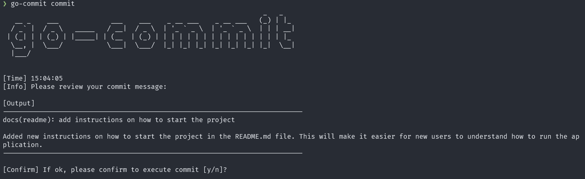

<div align="center">
    
    <h2>go-commit</h2>
    <p>The CLI to generate commit with karma style</p>
</div>

### Prerequisite

- Go
- OpenAI Token

### Install

```bash
go install github.com/ak9024/go-commit@latest
```

### How to run?

```bash
cd <your-repo>
git add .
go-commit
```

### Screenshoot

<div align="center">
    
    
</div>
