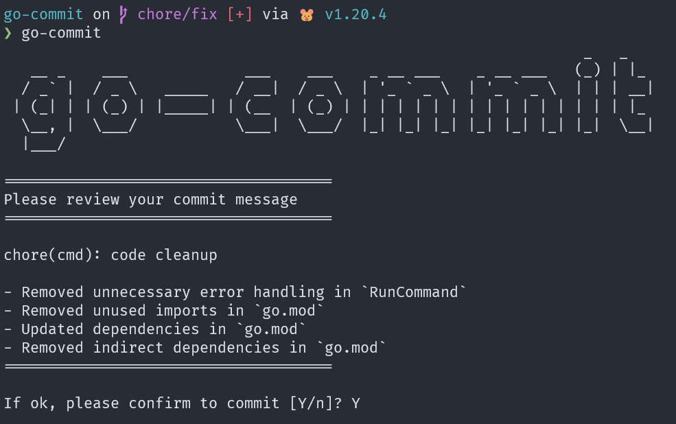

<div align="center">
    
    <h2>go-commit</h2>
    <p>The CLI to generate commit with karma style</p>
</div>

### Prerequisite

- [Go](https://go.dev/doc/install)
- [OpenAI Key](https://platform.openai.com/account/api-keys)

### Install

```bash
go install github.com/ak9024/go-commit@latest
```

### Setup

```bash
export OPENAI_API_KEY=<token>

# or open file ~/.zshrc
# add "export OPENAI_API_KEY=<token>"
# source ~/.zshrc
```

### How to run?

```bash
cd <your-repo>
git add .
go-commit commit

# for help
go-commit -h
```
